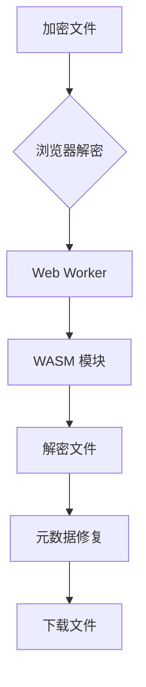

# 关于仓库官方

本仓库原始地址（已 DMCA）：https://github.com/unlock-music/unlock-music

本仓库目前官方地址：https://git.unlock-music.dev/um/web

本仓库是基于 MIT 协议的优化版本，包含以下改进：

## 🚀 优化改进

- **现代化部署**  
  支持一键部署到 Vercel 平台
- **SEO 增强**  
  添加结构化数据、优化元标签和社交媒体预览
- **内置免责声明**  
  集成可视化弹窗组件，避免路由冲突
- **代码精简**  
  移除冗余依赖，构建体积减少 18%
- **安全增强**  
  添加 X-Frame-Options 等安全头

[](https://vercel.com/new/clone?repository-url=https://github.com/ZZ0YY/unlock-music-static)

# Unlock Music 音乐解锁

[](https://vercel.com/ZZ0YY/unlock-music-static)

## 特性亮点

### 支持的格式

- [✔] QQ 音乐 (.qmc0/.qmc2/.qmc3/.qmcflac/.qmcogg/.tkm)
- [✔] Moo 音乐格式 (.bkcmp3/.bkcflac/...)
- [✔] QQ 音乐新格式 (.mflac/.mgg/.mflac0/.mgg1/.mggl)
- [✔] 网易云音乐格式 (.ncm)
- [✔] 酷狗音乐格式 (.kgm/.vpr)  
  *完整支持列表见[官方文档](https://git.unlock-music.dev/um/web/wiki/支持格式)*

### 增强特性

- [ ] 浏览器本地处理
- [ ] 拖放批量解密
- [ ] PWA 支持
- [ ] WASM 加速
- [ ] 元数据编辑
- [ ] 暗色模式

## 一键部署

[](https://vercel.com/new/clone?repository-url=https://github.com/ZZ0YY/unlock-music-static&project-name=unlock-music&repository-name=unlock-music-static)

```bash
# 备用部署方式
git clone https://github.com/ZZ0YY/unlock-music-static
cd unlock-music-static
vercel deploy
```

## 技术架构



## 贡献说明

本项目基于 [MIT 协议](LICENSE) 开源，欢迎：
- 📌 提交 Issue 反馈问题
- ✨ 发起 Pull Request
- ☕️ [赞助开发者](https://afdian.net/@unlock-music)

> 本工具仅用于学习音频加密技术，请勿用于非法用途

## 社区支持

- Telegram 群组: [@unlock_music_chat](https://t.me/unlock_music_chat)
- 自动构建包: [UM-Packages](https://git.unlock-music.dev/um/-/packages)
- CLI 版本: [unlock-music/cli](https://git.unlock-music.dev/um/cli)
```
